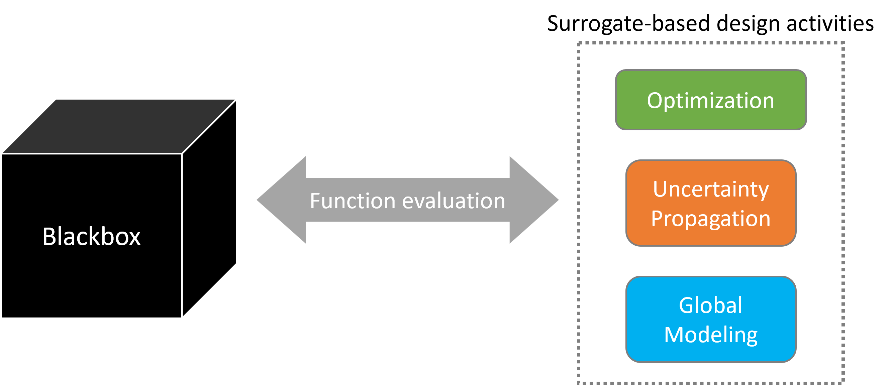

=========
Blackbox
=========

Complex simulations are ubiquitous in various engineering and scientific domains. These simulations often involve solving complex set of equations, running time-consuming numerical methods, or executing multi-physics models. This makes it harder to directly use these simulations for tasks such as optimization, uncertainty quantification, sensitivity analysis, etc. To alleviate this challenge, surrogate models are employed to approximate the behavior of these simulations. These models are often built using the data generated from running these simulations at given input points. Typically, running these simulations require significant efforts in terms of pre-processing, configuration, simulation execution, and post-processing.

The primary motivation behind **Blackbox** is to solve this issue by providing a consistent, easy-to-use API for evaluating such problems for a given input(s). By abstracting away the complexities of problem/simulation setup, execution, and data handling, the package allows users to focus on higher-level tasks such as surrogate modeling, optimization, uncertainty quantification, etc., rather than on managing individual simulation workflows. The user provides samples (or inputs) for evaluation to Blackbox, which internally handles the entire workflow and returns the desired outputs. This is illustrated in the below figure:

|

Blackbox is being actively developed to add a wide range of problems from different domains. For the sake of completeness, these problems range from simple analytical functions to complex engineering simulation pipelines. Currently, following problems are implemented within Blackbox:

- Single-output analytical problem
- Multi-output analytical problem
- Rover trajectory problem
- Half-cheetah problem
- Airfoil problem
- Wing problem
- Static aerostructural problem

Refer to example section for more details on these problems and how to use them within higher-level tasks such as surrogate modeling, optimization, uncertainty quantification, etc.

.. toctree::
    :hidden:
    :maxdepth: 0

    install
    basic_tutorials
    api/API