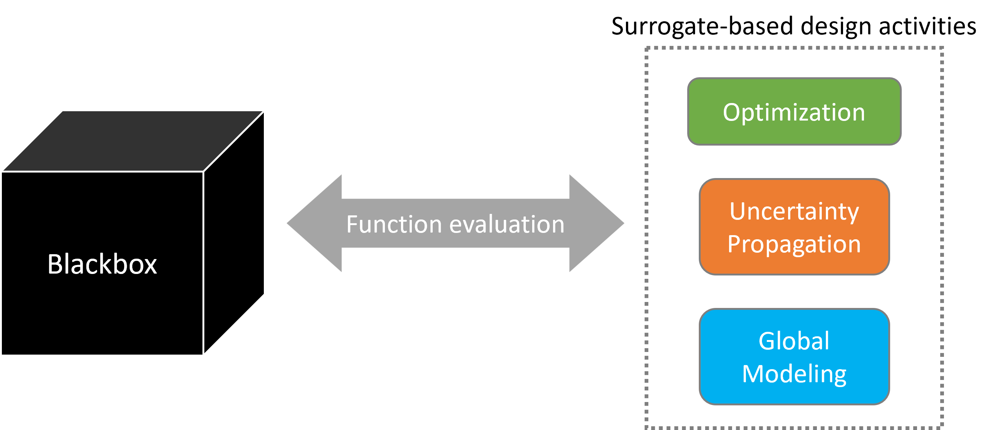

=============
Introduction
=============

Complex simulations are ubiquitous across engineering and scientific disciplines. These simulations often require solving systems of complex equations, performing computationally expensive numerical procedures, or coupling multiple physics models. As a result, evaluating a simulation can be computationally expensive and may require substantial effort in addition to the simulation itself. This makes it challenging to directly use high-fidelity simulations for downstream tasks such as optimization, uncertainty quantification, sensitivity analysis, and design exploration.

Surrogate models can alleviate this challenge by approximating the behavior of expensive simulations using data generated from simulations evaluated at selected input points. However, generating this data is itself often a nontrivial process. A typical simulation workflow may involve geometry generation, mesh generation, solver configuration, simulation execution, and post-processing, with each step requiring problem-specific setup and data handling.

The primary motivation behind **Blackbox** is to provide a consistent and easy-to-use API for evaluating a wide range of problems. Blackbox abstracts away the details of problem setup, simulation execution, and data handling, allowing users to interact with a problem simply by providing input samples and receiving the corresponding outputs. This enables users to focus on higher-level tasks such as surrogate modeling, optimization, uncertainty quantification, and sensitivity analysis, without having to manage the underlying simulation workflow.

The overall concept is illustrated in the figure below:

Refer to specific problem sections for more details and how to use them within higher-level tasks such as surrogate modeling, optimization, uncertainty quantification, etc.