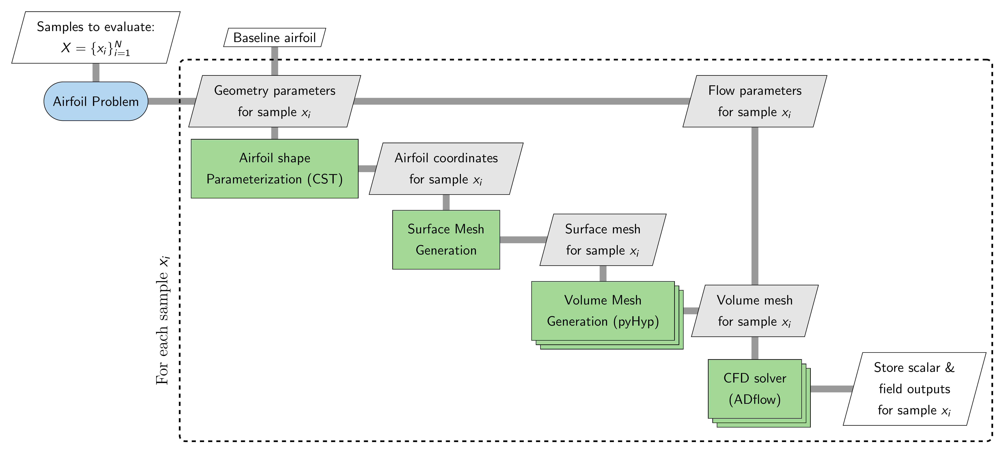

=================
Airfoil Problem
=================

The ``Airfoil`` problem provides an interface for generating aerodynamic datasets for airfoils using high-fidelity computational fluid dynamics (CFD) workflow. Users can parameterize both the airfoil geometry and flow conditions and evaluate the resulting configurations without manually setting up the geometry, meshing, solver, and post-processing workflow. The ``Airfoil`` problem currently uses ADflow_ as the CFD solver and the Class-Shape Transformation (CST_) method for airfoil geometry parameterization. Additional CFD solvers, such as OpenFOAM and SU2, may be supported in future releases. The following sections describe the dependencies, computational workflow, and how to generate aerodynamic datasets with the ``Airfoil`` problem.

Dependencies
=============

The ``Airfoil`` problem requires several additional packages that must be installed before using this problem. The required packages and their corresponding versions are listed below.

.. list-table::
   :header-rows: 1
   :widths: auto

   * - Package
     - Version
     - Comments
   * - `mpi4py`_
     - 3.1.6
     - Used for parallel processing during volume mesh generation and CFD solver execution
   * - `mdolab-baseclasses`_
     - >= 1.8.4
     - Provides ``AeroProblem`` for defining flow and operating conditions
   * - `pyHyp`_
     - >= 2.6.2
     - Used for generating the CFD volume mesh from the surface mesh
   * - `cgnsutilities`_
     - >= 2.8.1
     - Used for refining/coarsening the generated volume mesh, only required if you set a non-zero value for ``refine_volume_mesh`` options
   * - `ADflow`_
     - 2.11.0
     - Used as the CFD solver for airfoil flow simulations
   * - `pyvista`_
     - `-`
     - Used for reading, processing, and writing surface and volume field data
   * - `h5py`_
     - `-`
     - Used for creating and storing field results in HDF5 format

.. _CST: https://doi.org/10.2514/1.29958
.. _mpi4py: https://mpi4py.readthedocs.io/en/3.1.6/
.. _mdolab-baseclasses: https://github.com/mdolab/baseclasses
.. _pyHyp: https://github.com/mdolab/pyhyp
.. _ADflow: https://github.com/mdolab/adflow
.. _cgnsutilities: https://github.com/mdolab/cgnsutilities
.. _pyvista: https://docs.pyvista.org/
.. _h5py: https://docs.h5py.org/

Make sure that all required packages are installed with compatible versions before using the Airfoil problem.

Workflow
=========

The ``Airfoil`` problem accepts a set of samples, where each sample contains parameter values. This set may contain a single sample or multiple samples. For each sample :math:`x_i` in the sample set, the ``Airfoil`` problem performs the sequence of operations described below:

1. **Airfoil shape parameterization**: The geometry parameters are used to define the airfoil shape through CST parameterization
2. **Surface mesh generation**: The resulting airfoil coordinates are used to generate the surface mesh
3. **Volume mesh generation**: A volume mesh is generated from the surface mesh using ``pyHyp``
4. **CFD analysis**: The volume mesh and the flow parameters are passed to the ``ADflow`` solver to compute the aerodynamic solution
5. **Output extraction**: Scalar and field quantities from the solver are extracted and stored in a folder

When multiple samples are provided, the workflow is evaluated for each sample, and the resulting outputs are stored separately for each sample. This allows the Airfoil problem to provide a consistent interface for generating datasets without requiring users to manually manage geometry processing, mesh generation, solver execution, or output handling.

The complete workflow is illustrated in the XDSM diagram below.

The stacked rectangles representing the volume-mesh generation and CFD analysis indicate that these operations use multiple processors through MPI. The ``Airfoil`` problem therefore abstracts the geometry processing, mesh generation, solver execution, and output handling required for each sample.

Basic usage
============

There are typically three main steps involved in the process of generating datasets: initializing the problem class, adding various parameters and running simulation for different parameter values. To get started with the ``Airfoil`` problem, you will need airfoil coordinates stored in a ``dat`` file. There are few important points to note regarding the ``dat`` file:

- The ``dat`` file must follow the selig format i.e. the points should start from trailing edge and go in counter-clockwise direction, and then back to trailing edge.

- The first and last point in the ``dat`` file should be same (for both sharp and blunt trailing edge). This ensures that airfoil surface created using those points is closed. It is recommended to have a blunt trailing edge.

- The number of points and their distribution defines the surface mesh for the airfoil. So, if you want specific distribution of points (e.g. more points near leading edge), then make sure that the points are distributed accordingly.

- The leading and trailing edge of the airfoil coordinates must lie on the x-axis.

- All the x-coordinates must be in the range of [0,1].

All the files used in below sections can be found in ``examples`` directory on github.

Initializing the problem
-------------------------

The following code snippet shows an example of how to initialize an ``Airfoil`` problem:

.. literalinclude:: ../../../examples/airfoil_adflow_cst/runscript.py
    :start-after: # rst INIT start
    :end-before: # rst INIT end

Let's go through the code step-by-step.

First, a ``solver_options`` dictionary is created to specify the settings used by ``ADflow``. The appropriate settings depend on the specific case being simulated, so make sure to set these options appropriately. Refer to `ADflow options <https://mdolab-adflow.readthedocs-hosted.com/en/latest/options.html>`_ for more details.

Next, an ``AeroProblem`` object is created to define the baseline flow conditions for the simulation. In this example, the angle of attack, Mach number, Reynolds number, temperature, and reference quantities are specified. ``AeroProblem`` is provided by the `MDOLab Baseclasses <https://mdolab-baseclasses.readthedocs-hosted.com/en/latest/pyAero_problem.html>`_ package and supports several different ways of specifying the flow conditions. Refer to the ``AeroProblem`` `documentation <https://mdolab-baseclasses.readthedocs-hosted.com/en/latest/pyAero_problem.html>`_ for a complete description of the available options.

Next, the ``AirfoilADflowCSTOptions`` dataclass is initialized which provides an interface for defining various configuration options for the ``Airfoil`` problem. This dataclass consists of various pre-defined options, along with three mandatory options: ``airfoil_file``, ``solver_options``, and ``aero_problem``. Refer :ref:`here <problems/airfoil:Options>` for a complete description of the available options. Finally, an ``AirfoilADflowCST`` object is created using the configured options. This object represents the initialized airfoil problem that provides an interface for defining various parameters and for evaluating different parameter sets.

The general initialization workflow can therefore be summarized as:

#. Define the ADflow solver settings using solver_options.
#. Define the baseline flow conditions using AeroProblem.
#. Creat the ``AirfoilADflowCSTOptions`` dataclass object using appropriate options.
#. Create the ``AirfoilADflowCST`` problem using the configured dataclass object.

Adding parameters
------------------

Next step is to add parameters that can be varied to generate datasets. The ``add_parameter`` method is used for adding parameters to the ``Airfoil`` problem. The ``add_parameter`` method requires three arguments:

- ``name (str)``: name of the parameter to be added. The possible parameter names are: 

    - ``lower_cst``: lower surface cst coefficients, the ``num_cst_lower`` option governs the number of CST coefficients

    - ``upper_cst``: upper surface cst coefficients, the ``num_cst_upper`` option governs the number of CST coefficients

    - ``alpha``: angle of attack of the flow

    - ``mach``: mach number of the flow

    - ``reynolds``: reynolds number for the flow

- ``lower_bound (numpy array or float)``: lower bound for the variable

- ``upper_bound (numpy array or float)``: upper bound for the variable

.. note:: To add ``mach``, ``alpha``, or ``reynolds`` as a parameter, it must be defined as one of the arguments while creating ``AeroProblem`` object
 
The following code snippet shows an example of how to add parameters:

.. literalinclude:: ../../../examples/airfoil_adflow_cst/runscript.py
    :start-after: # rst PARM start
    :end-before: # rst PARM end

Evaluating samples
-------------------

After adding the parameters, evaluating samples is straightforward. Following code snippet illustrates how to evaluate a set of samples:

.. literalinclude:: ../../../examples/airfoil_adflow_cst/runscript.py
    :start-after: # rst RUN start
    :end-before: # rst RUN end

First, 10 samples are generated using a Latin hypercube sampling (LHS) method within a unit hypercube. You can use any sampling method of your choice to generate the samples. These samples are then scaled to the appropriate bounds for the problem. The bounds can be accessed through the ``bounds`` property of the initialized problem object. This property is a tuple containing two 1D numpy arrays: the first array contains the lower bounds and the second array contains the upper bounds.

In the code snippet above, ``samples`` is a numpy array with shape (10, 15). The 10 represents the number of samples, while 15 represents the number of parameters. Each row in ``samples`` array corresponds to a different sample, i.e., a different set of parameter values. The order of the values in each row is determined by the order in which the parameters were added to the problem. For example, in this case, the first six entries correspond to the lower CST parameters, the next six entries correspond to the upper CST parameters, and the remaining three entries correspond to Mach number, angle of attack, and Reynolds number, respectively.

The initialized ``Airfoil`` problem object (``airfoil`` in this case) can then be called with the samples to be evaluated. The ``__call__`` method accepts two arguments:

- ``x (numpy array)``: an array of shape (N,D) or (D,) representing the samples to be evaluated. Here, ``N`` denotes the number of samples and ``D`` denotes the number of parameters

- ``return_results (bool)``: a flag indicating whether the results should be returned by the function (default = ``False``). Set this to ``True`` when the results are needed directly in Python, such as during active learning. When ``return_results`` is ``False``, the requested outputs from each simulation are stored in the corresponding sample directory.

Once the dataset generation process starts, a directory with the name specified by the ``directory`` option is created. All generated data are stored within this directory. The directory structure is organized as follows:

- The main directory contains a ``description.txt`` file that provides information about the generated dataset, including the parameters and their bounds.

- A separate subdirectory is created for each evaluated sample. The subdirectories are numbered sequentially starting from ``1`` (i.e., ``1``, ``2``, ``3``, and so on), with each number corresponding to the row of the samples array that was evaluated. For example, the directory ``1`` contains the results for ``samples[0]``, ``2`` contains the results for ``samples[1]``, and so on.

- Each sample directory contains the files generated during the simulation. Depending on the options provided during initialization, the following files may be present:

  - ``log.txt``: a log file containing messages generated during mesh generation and solver execution
  - ``parameters.json``: a JSON file containing the parameter values used for the sample
  - ``scalar_outputs.json``: a JSON file containing the scalar outputs specified by the ``scalar_outputs`` option.
  - ``surface_solution.cgns``: the surface solution written by the solver. This file is stored only when ``write_surface_output`` is set to ``True``
  - ``volume_solution.cgns``: the volume solution written by the solver. This file is stored only when ``write_volume_output`` is set to ``True``
  - ``surface_outputs.hdf5``: field data extracted from the surface solution and stored in an HDF5 file. This file is stored only when ``write_surface_output`` is set to ``True``. It will contain entities provided in the ``surface_outputs`` option
  - ``volume_outputs.hdf5``: field data extracted from the volume solution and stored in an HDF5 file. This file is stored only when ``write_volume_output`` is set to ``True``. It will contain entities provided in the ``volume_outputs`` option
  - ``airfoil.png``: a figure showing the deformed airfoil and the baseline airfoil

Options
========

Following is the exhaustive list of options that can be set by the user for the ``Airfoil`` problem:

.. pydantic-options:: blackbox.airfoil_adflow_cst_problem.AirfoilADflowCSTOptions
